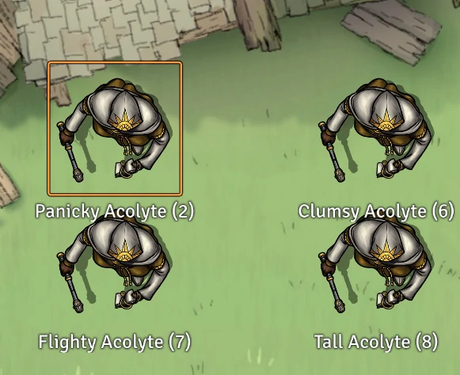
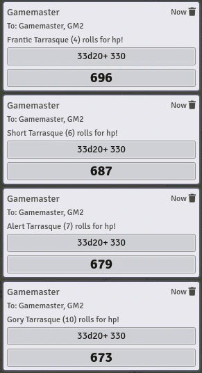

# Token Mold
      

What is a foundry without its molds? This module provides you with a customizable mold for your Tokens.  
On creation each Token will fit snuggly into the pattern of your mold.  

## Feature Overview
- [Token Mold](#token-mold)
	- [Feature Overview](#feature-overview)
	- [Usage](#usage)
- [Important Information!](#important-information)
	- [FVTT Version compatibility](#fvtt-version-compatibility)
	- [Bug Reporting and Feature Suggestions](#bug-reporting-and-feature-suggestions)
	- [Attribution](#attribution)
	- [Licensing](#licensing)
	- [Support the development](#support-the-development)
- [FAQ](#faq)
		- [Why are there so many confusing attributes to choose from?](#why-are-there-so-many-confusing-attributes-to-choose-from)
		- [Why are there only squares shown for icon selections dropdown in Firefox?](#why-are-there-only-squares-shown-for-icon-selections-dropdown-in-firefox)
- [Features](#features)
	- [Automatic Indexing](#automatic-indexing)
	- [Naming options](#naming-options)
		- [Random Name Generation](#random-name-generation)
			- [How does this work?](#how-does-this-work)
		- [Random adjectives](#random-adjectives)
		- [Hide Names](#hide-names)
	- [Override Token Config](#override-token-config)
	- [Hit Point Rolling](#hit-point-rolling)
	- [Customizable Token Overlay](#customizable-token-overlay)
	- [Automatic Token Scaling](#automatic-token-scaling)

## Usage
Pull a token onto the canvas and the chosen pattern will be automatically applied to your Token.
  

# Important Information!
## FVTT Version compatibility
My focus is the FVTTs stable branch. I will neither promise nor prioritise updates for FVTTs beta or alpha branches! Feel free to report a bug so i know whats coming, but don't expect a fix before a stable FVTT update.

## Bug Reporting and Feature Suggestions
Go to the [GitHub's issue board](https://github.com/Moerill/Token-Mold/issues) and create an issue with the template fitting to what you want to post and follow its instructions.

**I will ignore half-hearted bug reports ignoring the issue template or Discord mentions!**  
Its not difficult to put at least some effort into something that you want someone else to put their spare time into to fix!  

## Attribution
Special thanks to Discord User @trdischat for providing the awesome name generation algorithm and data!
Also thanks to:
* @CarnVanBeck for adding localization support and the german translation!
* Discord User @BrotherSharp for the japanese adjectives
* Ben Howard for extending the english adjective list massively
* Discord User @CosmoCorban for the spanish adjectives
* Discord User @MagicRabbit for the french adjective lists

Thanks to @NickEast for his  which i'm using in a modified version for my building and publishing workflow.

## Licensing

This work is licensed under Foundry Virtual Tabletop [EULA - Limited License Agreement for module development](https://foundryvtt.com/article/license/).

## Support the development
I'm doing this project mostly alone (with partial help of some wonderful people mentioned above) in my spare time and for free.  
If you want to encourage me to keep doing this, i am happy about all kind of tokens of appreciation. (Like some nice words, recommending this project, contributions to the project or even a small donation over at my [PayPal](https://www.paypal.com/cgi-bin/webscr?cmd=_s-xclick&hosted_button_id=FYZ294SP2JBGS&source=url)).  

# FAQ
### Why are there so many confusing attributes to choose from?
To allow *Token-Mold* to be usable for all kind of systems the module generates a list of possible attribute values dependend on the systems default data model. Since the module can not decide which are useful to use or which are not all possible values are shown. Although this may be kind of confusing or annoying this is a decision made to ensure that most *Token-Mold* features are universally usable.

### Why are there only squares shown for icon selections dropdown in Firefox?
This is a current bug in Firefox in combination with icons inside of html options tags. They will show properly inside the select box when selected though. My suggestion here is that you either focus the box and then switch between the selections using the arrow keys or use a different browser for this configuration.  
After they're selected they should display fine in the overlay and the select box!

# Features
## Automatic Indexing
You like to name all your goats "goat"? Don't worry this mod is here to help you differentiate them!
Just let *Token-Mold* add a number as suffix and you're fine.  
  
You want to let your goat army sound bigger than they really are? Don't worry, *Token-Mold* got you covered!  
Besides just counting upwards on the indexing, you can even set a random offset range, to provide some variety and prevent metagaming from your players. ("Oh we can see goat 1 and 4.. so at least 2 are missing!")  

  

## Naming options
### Random Name Generation
Tired of your whole army reacting, when you call "Kobold"?  
Try the new random name generator by trdischat!  
Choose from up to 35 different languages, to generate your names from.  
Do these names kind of almost sound like real words? Yes, absolutely! [Why?](#how-does-this-work?)  
Here a few examples:  
  
Some more explanation:  
You can create a list of your actors attributes, each with their own list of custom value - language pairs. When this option is active and you create a token *Token-Mold* will go through your list of attributes and values and tries to find the first attribute-value match, to select a language for the name generation. If no match is found, the default language will be taken.  
Using the chosen language *Token-Mold* will now generate a name for the token using trdischat awesome algorithm!  
**My advice here is to go from more specific values to more generic from top to bottom.** If we take the 5e system as example, we start with the very specific attribute ``name`` to check for creatures, like *Orcs,Kobolds, Goblins*. In the SRD the only way to specifically identify their type is through their name. Then we start to be more general by selecting the ``type`` attribute as a more generic form of identifying creatures. Here we choose values like *humanoid, beast, fiend, giant*.  

A bonus treat for DnD5e users: trdischat has created a predefined list of attributes, values and languages for you to use.  

Awesome, but..

#### How does this work?
The algorithm tries to generate a word using letter frequencies sampled for 35 different languages. So each letter is chosen randomly based on the previous two letters and weighted by their frequency of appereance. 

### Random adjectives
What? you can't speak those newly generated names out loud? No problem, here is some more help to make your minions more descriptive, by adding random adjectives to their names!  
Just choose one rollable table of your choice inside the settings menu and you're good to go! Token Mold does ship with a few for different languages, all created through community effort. If you happen to have a nice list and think it would be nice to ship it with the module, just contact me or send a pull request to this repo and i'll add it!  
  

### Hide Names
Don't like names at all? You can just let *Token-Mold* delete the tokens name so your players will never know what hit them! (Or maybe they just know that it was **Bamboozled 8**, but not what he/she/it is.)

## Override Token Config
Don't like how you set up all your tokens? Or you dislike the default settings set for a compendium? Then you got the perfect module! Set your wanted configuration in the menu and it will automatically get applied to every token you from now on create!

## Hit Point Rolling
(DnD5e only)
To lazy to roll your minions hit points yourself? Don't worry, *Token-Mold* automates that for you!
If you have a hit dice formula defined for your NPC, your token will automatically roll and set the hp, as well as notify you (if set to).  
  

## Customizable Token Overlay
Want to quickly check how much money your minion can steal from your players without opening their sheet? Or quickly check their passive perception or armor class? Just configure the overlay to your liking and activate it. Now hover over the tokens to quickly check the set up stats!  
The overlay will only show if you're the tokens owner.  
  

## Automatic Token Scaling
(DnD5e and PF2 only)
Again to lazy to configure your tokens?  
Or got a 10ft map now and don't want to rescale everything?  
Just activate this feature and it will do the work for you, by automatically choosing the correct size based on the tokens set creature size and the map size. (Works only with scenes grid units set to multiples of "ft", "ft." or "feet")
